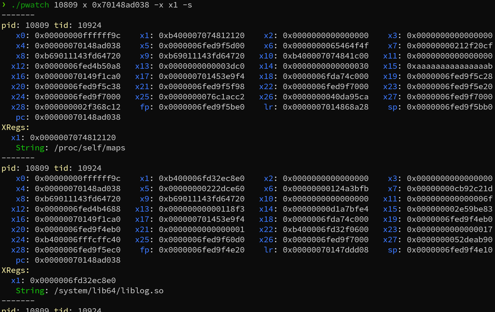

# pwatch
# pwatch
Refer to：
[pwatch](https://github.com/ri-char/pwatch) - A cli tool that uses perf_event to install a hardware breakpoint/watchpoint on a process in linux. 
Extend pwatch to enable reading data (string or bytes) at the address pointed to by the pointer in register  through inter process reading (process_vm_readv).

## Usage

```
pwatch <PID> <TYPE> <ADDR>
pwatch -t <TID> <TYPE> <ADDR>
```
For example1:
```bash
pwatch 31737 rw4 0x55fa689a90
```
This will install a read/write 4 byte watchpoint on the address `0x55fa689a90` of all threads in the process with pid `31737`.

    example2:
```bash
pwatch 31737 x 0x700faad038 -x x1 -s
```
This will install an execve watchpoint on the address `0x700faad038` of all threads in the process with pid `31737`, and will read the string at the address pointed to by the pointer in register x1 when the watchpoint is triggered.

    example3:
```bash
pwatch 31737 x 0x700faad038 -x x1 pc
```
This will install an execve watchpoint on the address `0x700faad038` of all threads in the process with pid `31737`, and will read 8 bytes at the address pointed to by the pointer in register x1 and pc when the watchpoint is triggered.

    example4:
```bash
pwatch 31737 x --so libgame.so 0x45567 -x x1 -s
```
pwatch now also supports specifying the SO file using the `--so` parameter and calculates the breakpoint address by adding the offset to the starting address of the SO file.

full arguments:
```
Usage: pwatch [OPTIONS] <PID> <TYPE> <ADDR>

Arguments:
  <PID>   target pid, if thread is true, this is the tid of the target thread
  <TYPE>  watchpoint type, can be read(r), write(w), readwrite(rw) or execve(x). if it is one of r, w, rw, the watchpoint length is needed. Valid length is 1, 2, 4, 8. For example, r4 means a read watchpoint with length 4 and rw1 means a readwrite watchpoint with length 1
  <ADDR>  watchpoint address, in hex format. 0x prefix is optional

Options:
      --buf-size <BUF_SIZE>  buffer size, in power of 2. For example, 2 means 2^2 pages = 4 * 4096 bytes [default: 0]
  -t                         whether the target is a thread or a process
  -b, --backtrace            whether to print backtrace
  -x, --xregs <XREGS>...     specify the registers to read as const char* pointers
  -s, --string               if provided, read the string at the register value address
      --so <SO>              specify the shared object file
  -h, --help                 Print help
```

## Output

